# WaterPaid — Documentation UML Complète

Ce document fournit tous les éléments nécessaires pour dessiner les diagrammes UML du système WaterPaid : cas d'utilisation, diagrammes de classes, diagrammes de séquence (workflows), et diagrammes d'état.

---

## 1. Acteurs du Système

| Acteur | Description |
|--------|-------------|
| **Utilisateur (User)** | Client final qui gère ses compteurs d'eau et effectue des recharges |
| **Administrateur (Admin)** | Gestionnaire qui crée les compteurs, supervise les utilisateurs et génère des rapports |
| **Système MQTT** | Broker IoT qui communique avec les compteurs physiques (ouverture/fermeture vanne) |
| **Device (Compteur physique)** | Hardware IoT LoRaWAN qui envoie les données de consommation et reçoit les commandes |

---

## 2. Diagramme d'Architecture Globale

Le diagramme d'architecture globale offre une vision macroscopique de l'écosystème WaterPaid. Il illustre la convergence entre les technologies mobiles (Flutter), les services cloud (FastAPI/Supabase), et le monde de l'Internet des Objets (IoT) via le réseau LoRaWAN. On y voit comment les flux de données circulent depuis le capteur physique jusqu'à l'utilisateur final, tout en intégrant des services tiers essentiels comme les passerelles de paiement (PayUnit). C'est la pierre angulaire de la compréhension système du projet.

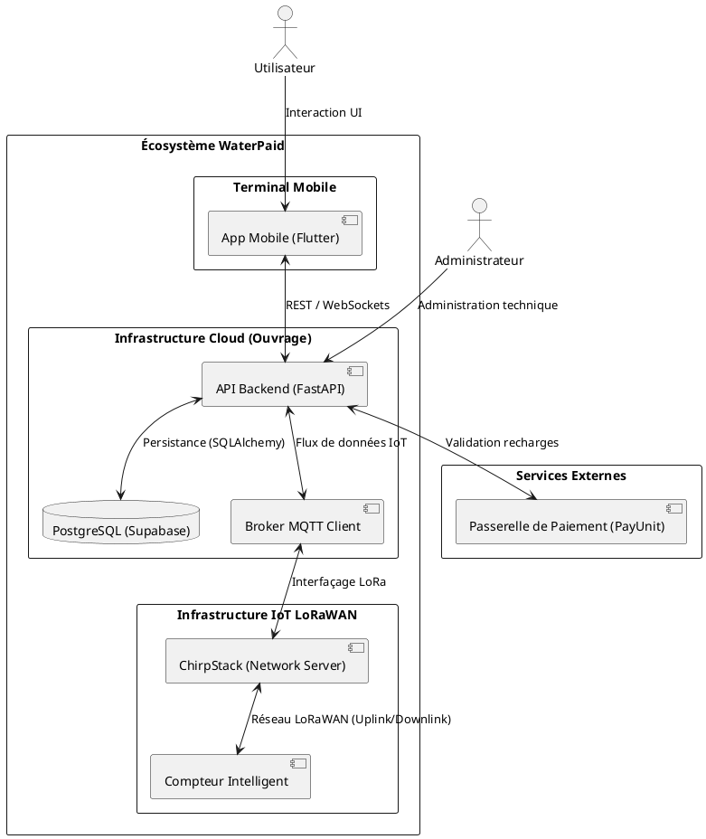

---

## 3. Diagramme de Cas d'Utilisation

### 3.1 Cas d'Utilisation — Utilisateur (User)

| ID | Cas d'Utilisation | Description | Préconditions | Postconditions |
|----|-------------------|-------------|---------------|----------------|
| UC-U01 | **S'inscrire** | Créer un compte utilisateur avec téléphone, pseudo et mot de passe | Aucune | Compte créé, token JWT généré |
| UC-U02 | **Se connecter** | Authentification par téléphone + mot de passe | Compte existant | Token JWT valide, redirection vers Dashboard |
| UC-U03 | **Se déconnecter** | Terminer la session | Connecté | Token supprimé du stockage local |
| UC-U04 | **Consulter le Dashboard** | Voir les statistiques : solde, total dépensé, compteurs actifs, recharges récentes | Connecté | Dashboard affiché |
| UC-U05 | **Lier un compteur** | Scanner un QR code ou entrer un token pour associer un compteur à son compte | Connecté, compteur non attribué | Compteur attribué à l'utilisateur |
| UC-U06 | **Délier un compteur** | Retirer un compteur de son compte | Connecté, compteur attribué à l'utilisateur | Compteur libéré |
| UC-U07 | **Effectuer une recharge** | Payer pour recharger un compteur (OM, MOMO, CASH) | Connecté, compteur lié | Recharge créée (PENDING), notification MQTT au device si SUCCEEDED |
| UC-U08 | **Consulter l'historique** | Voir toutes ses recharges passées | Connecté | Liste des recharges affichée |
| UC-U09 | **Voir son profil** | Consulter ses informations personnelles | Connecté | Profil affiché |

### 3.2 Cas d'Utilisation — Administrateur (Admin)

| ID | Cas d'Utilisation | Description | Préconditions | Postconditions |
|----|-------------------|-------------|---------------|----------------|
| UC-A01 | **S'inscrire (Admin)** | Créer un compte administrateur | Aucune | Compte admin créé, token JWT généré |
| UC-A02 | **Se connecter** | Authentification admin | Compte existant | Token JWT valide, redirection vers Admin Dashboard |
| UC-A03 | **Consulter le Dashboard Admin** | Vue globale : compteurs, utilisateurs, activité récente | Connecté (admin) | Statistiques affichées |
| UC-A04 | **Créer un compteur** | Enregistrer un nouveau compteur virtuel (serial_id, device_id optionnel) | Connecté (admin) | Compteur créé avec token unique |
| UC-A05 | **Lister les compteurs** | Voir tous les compteurs gérés par l'admin | Connecté (admin) | Liste affichée |
| UC-A06 | **Voir détails d'un compteur** | Infos complètes : état, token, utilisateur assigné, device lié | Connecté (admin) | Détails affichés |
| UC-A07 | **Modifier un compteur** | Changer l'état (ACTIVE/INACTIVE/MAINTENANCE), assigner un utilisateur | Connecté (admin), compteur existant | Compteur mis à jour |
| UC-A08 | **Supprimer un compteur** | Retirer définitivement un compteur | Connecté (admin), compteur existant | Compteur supprimé avec ses recharges |
| UC-A09 | **Générer un token** | Créer un nouveau token d'appairage pour un compteur | Connecté (admin), compteur existant | Nouveau token UUID généré |
| UC-A10 | **Lier un device** | Associer un compteur physique (LoRaWAN) à un compteur logique | Connecté (admin), device existant | Device lié au compteur |
| UC-A11 | **Recharger manuellement** | Effectuer une recharge CASH immédiatement validée (SUCCEEDED) | Connecté (admin), compteur attribué | Recharge créée + notification MQTT au device |
| UC-A12 | **Lister les utilisateurs** | Voir les utilisateurs assignés aux compteurs de l'admin | Connecté (admin) | Liste affichée |
| UC-A13 | **Consulter l'historique** | Voir l'historique de recharges par utilisateur ou par compteur | Connecté (admin) | Historique affiché |
| UC-A14 | **Générer un rapport** | Créer un rapport CSV ou PDF sur une période donnée | Connecté (admin) | Rapport créé |
| UC-A15 | **Lister les rapports** | Voir tous les rapports générés | Connecté (admin) | Liste affichée |
| UC-A16 | **Mettre à jour statut recharge** | Changer le statut d'une recharge (PENDING → SUCCEEDED/FAILED) | Connecté (admin) | Recharge mise à jour, notification MQTT si SUCCEEDED |
| UC-A17 | **Délier un utilisateur** | Retirer un utilisateur d'un compteur (l'utilisateur ne pourra plus utiliser ce compteur) | Connecté (admin), compteur attribué | Compteur libéré (user_id=null, attributed=false) |

### 3.3 Diagramme PlantUML — Cas d'Utilisation

Ce diagramme de cas d’utilisation synthétise les fonctionnalités offertes par la plateforme WaterPaid. Il met en évidence la séparation des responsabilités entre l'utilisateur final (gestion de sa consommation et paiement) et l'administrateur technique (gestion de flotte IoT et supervision). L'inclusion du système MQTT souligne l'importance de l'interaction physique avec les compteurs, qui est le cœur de métier du projet.

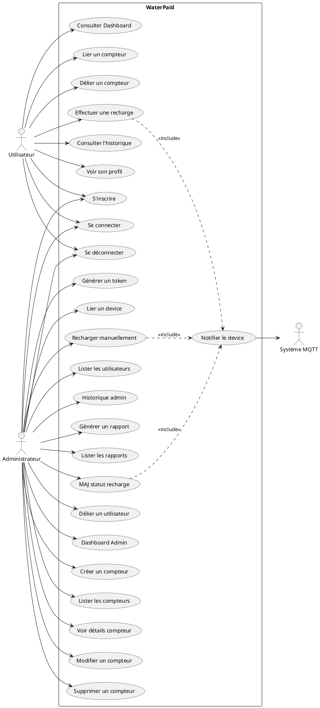

---

## 4. Diagramme de Classes

### 4.1 Entités et Attributs

Le diagramme de classes suivant modélise le domaine métier de WaterPaid. Il reflète la structure de données persistée en base de données PostgreSQL (via Supabase). On y retrouve les concepts clés de l'application : la gestion des utilisateurs, les compteurs logiques (`Meter`) liés aux dispositifs physiques (`Device`), ainsi que la traçabilité des recharges financières. Les relations de cardinalité (1-1 ou 1-*) garantissent l'intégrité référentielle du système.

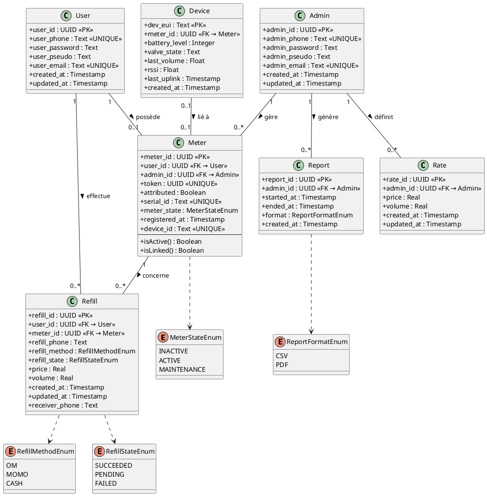

### 4.2 Résumé des Relations

| Relation | Cardinalité | Description |
|----------|-------------|-------------|
| User ↔ Meter | 1 — 0..1 | Un User possède au maximum un compteur (relation `uselist=False`) |
| Admin ↔ Meter | 1 — 0..* | Un Admin gère plusieurs compteurs |
| User ↔ Refill | 1 — 0..* | Un User effectue plusieurs recharges (cascade delete) |
| Meter ↔ Refill | 1 — 0..* | Un Meter est concerné par plusieurs recharges (cascade delete) |
| Admin ↔ Report | 1 — 0..* | Un Admin génère plusieurs rapports (cascade delete) |
| Admin ↔ Rate | 1 — 0..* | Un Admin définit plusieurs tarifs (cascade delete) |
| Device ↔ Meter | 0..1 — 0..1 | Un Device physique est lié à un Meter logique |

---

## 5. Diagramme de Classes — Services (Couche Métier)

Au-delà des données, ce diagramme illustre l'organisation de la logique métier (Business Logic) au sein du backend FastAPI. L'architecture repose sur des services spécialisés qui orchestrent les opérations complexes, comme la validation des paiements ou l'envoi de commandes LoRaWAN via MQTT. Cette séparation des préoccupations (SoC) permet une maintenance aisée et une évolutivité du système.

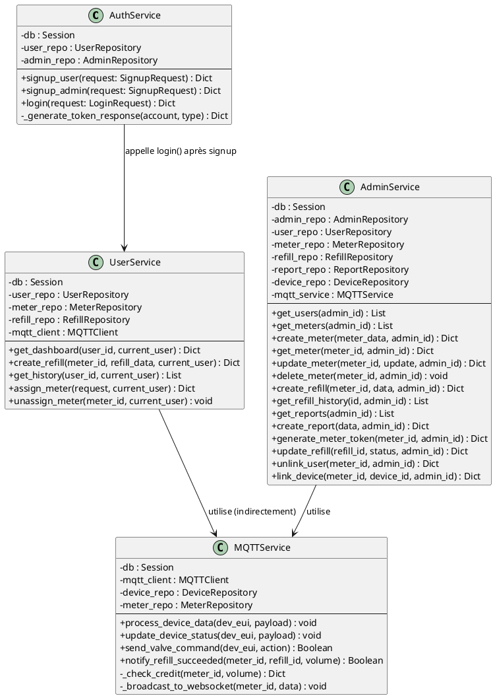

---

## 6. Workflows — Diagrammes de Séquence

### 6.1 Inscription et Connexion (User & Admin)

Ce workflow détaille la sécurisation des accès. Il met en scène l'échange de jetons JWT (JSON Web Tokens) signés en HS256, assurant que seules les requêtes authentifiées peuvent interagir avec les ressources sensibles du système.

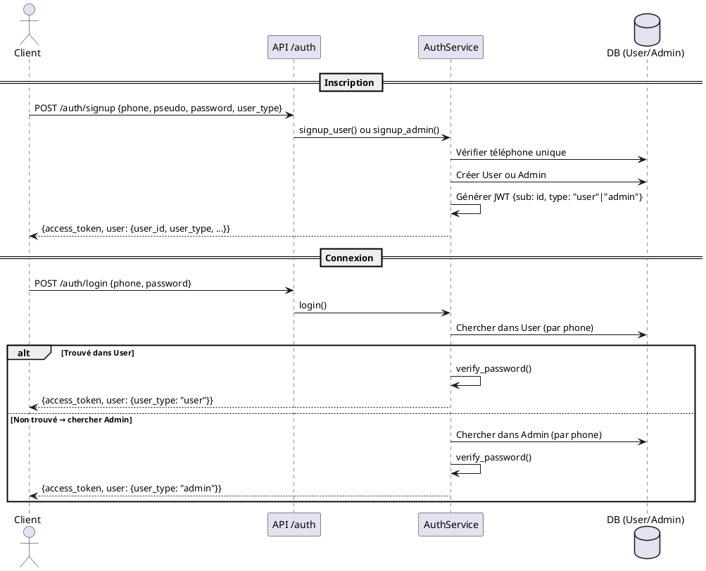

### 6.2 Workflow User — Lier un compteur

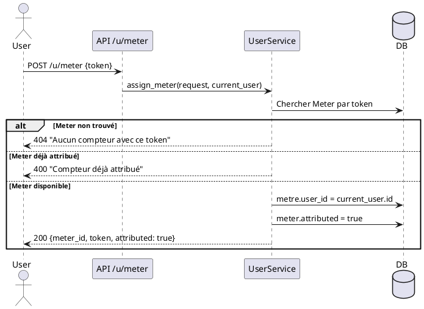

### 6.3 Workflow User — Effectuer une recharge

C'est le processus critique du système. Ce diagramme de séquence illustre la chaîne complète : du déclenchement du paiement sur l'application mobile à l'ouverture physique de la vanne d'eau. Il met en évidence l'interaction asynchrone entre le backend et le réseau LoRaWAN via le protocole MQTT.

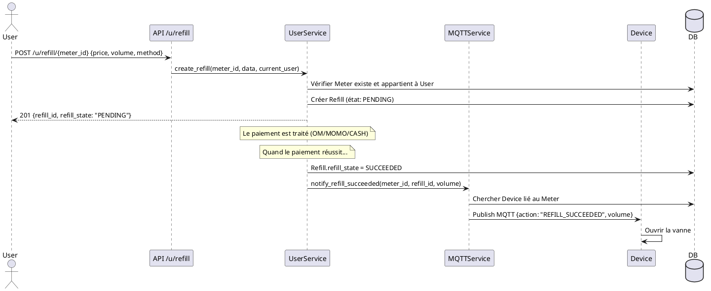

### 6.4 Workflow Admin — Créer un compteur

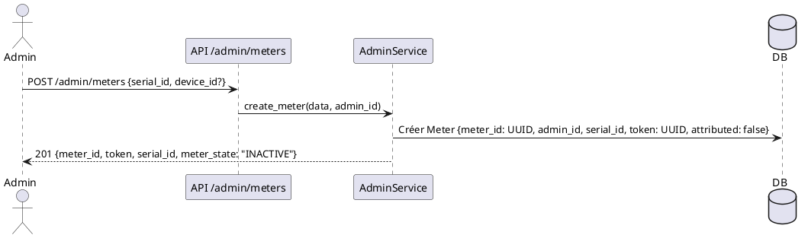

### 6.5 Workflow Admin — Recharge manuelle

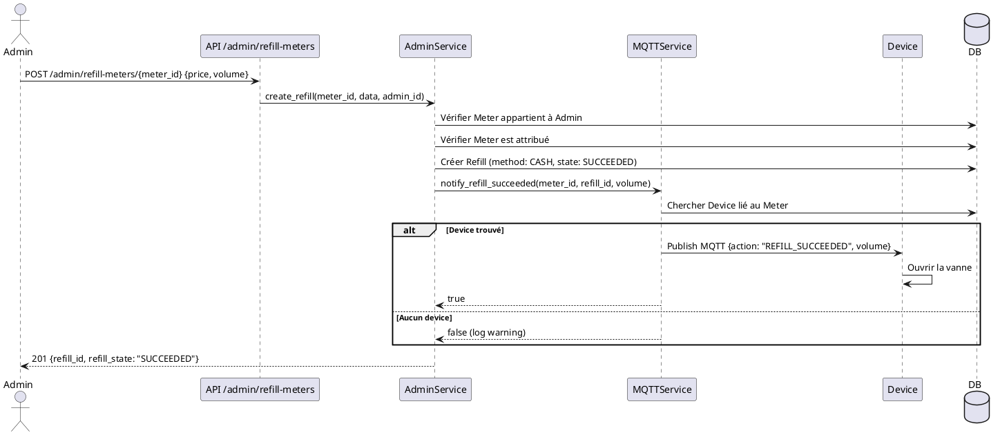

### 6.6 Workflow Admin — Lier un device physique

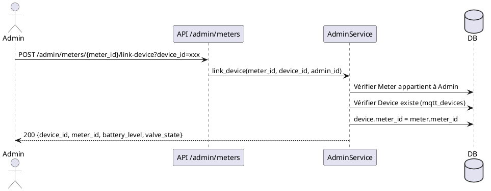

### 6.7 Workflow Admin — Délier un utilisateur

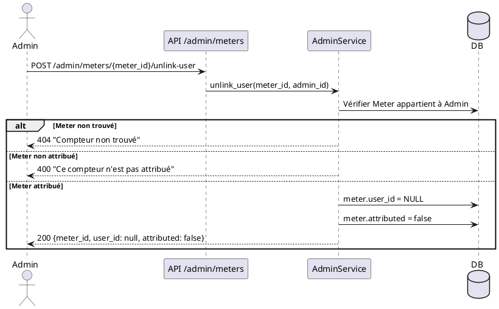

### 6.8 Workflow MQTT — Réception données device

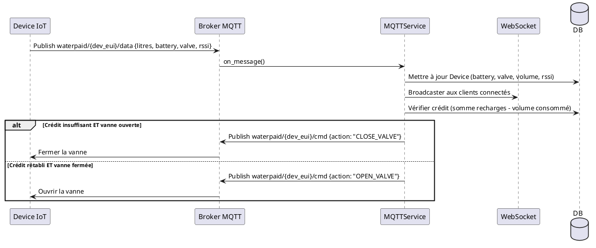

---

## 7. Diagramme d'États — Cycle de Vie du Compteur (Meter)

Ce diagramme modélise la vie administrative et opérationnelle d'un compteur IoT au sein du système. Il est crucial pour garantir l'intégrité du parc matériel.

### Description des États
*   **INACTIVE** : État initial lors de l'enregistrement du numéro de série. Le compteur existe dans la base mais est "dormant". Il ne peut pas être attribué à un client.
*   **ACTIVE** : Le compteur est en service. Il écoute le réseau LoRaWAN et peut être lié à un utilisateur. C'est le seul état permettant la consommation d'eau.
    *   *Sous-état : Non Attribué* — Le compteur est libre, en attente d'un QR Scan.
    *   *Sous-état : Attribué* — Le compteur est lié à un `user_id`.
*   **MAINTENANCE** : État transitoire pour les interventions techniques (changement de batterie, réparation). Le compteur est déconnecté logiquement des utilisateurs pour éviter les fausses alertes.

### Description des Transitions
Le passage de `INACTIVE` à `ACTIVE` est une action manuelle de l'administrateur (Provisioning). Inversement, la mise en `MAINTENANCE` est une décision de gestion. L'attribution (`Attributed`) est déclenchée par l'utilisateur final via l'application mobile (Scan QR), mais n'est possible que si le compteur est d'abord `ACTIVE`.

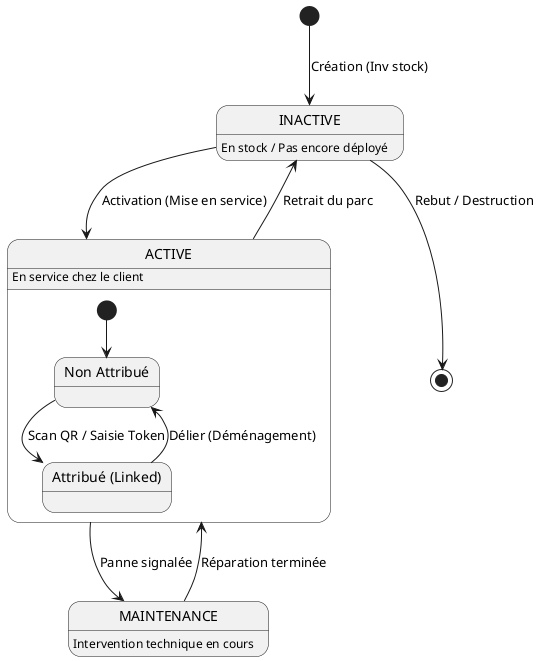

## 8. Diagramme d'États — Cycle de Vie d'une Recharge (Refill)

Ce diagramme illustre le processus transactionnel financier. Il sécurise le chiffre d'affaires en garantissant qu'aucune goutte d'eau n'est distribuée sans une validation bancaire préalable.

### Description des États
*   **PENDING (En attente)** : La transaction est initiée par l'utilisateur. Une référence de paiement est créée, mais l'argent n'est pas encore confirmé.
*   **SUCCEEDED (Succès)** : La passerelle de paiement (PayUnit) ou l'administrateur a confirmé la réception des fonds. C'est l'état final positif.
*   **FAILED (Échec)** : La transaction a été annulée, refusée par la banque ou a expiré. C'est un état final négatif.

### Description des Transitions et Effets de Bord
*   **Confirmation (Pending → Succeeded)** : Cette transition est critique. Elle déclenche automatiquement un événement système (`Event Hook`) qui :
    1.  Crédite le solde virtuel du compteur.
    2.  Envoie un ordre MQTT `OPEN_VALVE` immédiat au compteur physique via le réseau LoRaWAN.
*   **Échec (Pending → Failed)** : Aucune action sur le matériel. L'utilisateur est notifié et doit recommencer.

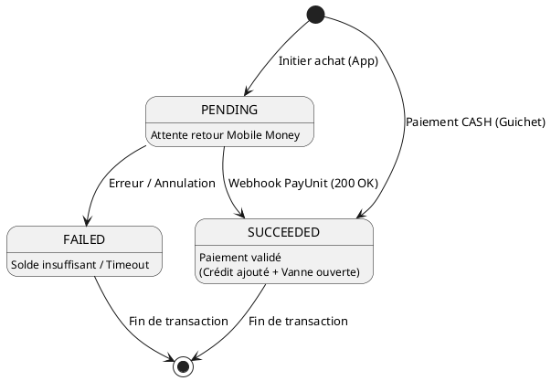

---

## 9. Résumé des Endpoints API

### 9.1 Public & Auth
| Méthode | Endpoint | Description |
| :--- | :--- | :--- |
| GET | `/` | Racine de l'API (Statut) |
| GET | `/health` | Test de santé (DB & MQTT) |
| POST | `/auth/signup` | Inscription Utilisateur/Admin |
| POST | `/auth/login` | Connexion (Retourne JWT) |

### 9.2 Utilisateur (Prefix: `/u`)
| Méthode | Endpoint | Description |
| :--- | :--- | :--- |
| GET | `/u/dashboard/{id}` | Stats dashboard (solde, conso) |
| GET | `/u/history/{id}` | Historique des recharges |
| PUT | `/u/me/` | Modifier profil (pseudo, tel) |
| PUT | `/u/me/change-password` | Changer mot de passe |
| POST | `/u/meter` | Assigner un compteur (via token) |
| DELETE | `/u/meter/{id}` | Dissocier un compteur |
| POST | `/u/refill/{id}` | Initier une recharge |

### 9.3 Administrateur (Prefix: `/a`)
| Méthode | Endpoint | Description |
| :--- | :--- | :--- |
| GET | `/a/` | Statistiques globales dashboard |
| GET | `/a/users` | Liste des clients gérés |
| GET | `/a/meters` | Liste des compteurs gérés |
| POST | `/a/meters` | Créer un nouveau compteur |
| GET | `/a/meters/{id}` | Détails techniques d'un compteur |
| PUT | `/a/meters/{id}` | Modifier un compteur |
| DELETE | `/a/meters/{id}` | Supprimer un compteur |
| POST | `/a/meters/{id}/generate-token` | Régénérer token d'appairage |
| POST | `/a/meters/{id}/link-device` | Lier device physique (LoRaWAN) |
| POST | `/a/meters/{id}/unlink-user` | Délier un utilisateur du compteur |
| POST | `/a/refill-meters/{id}` | Recharge manuelle (CASH) |
| PUT | `/a/refill-meters/{id}` | Modifier statut recharge |
| GET | `/a/histories/{id}` | Historique recharges (filtre id) |
| GET | `/a/reports` | Liste des rapports générés |
| POST | `/a/reports` | Générer un rapport CSV |
| PUT | `/a/me/` | Modifier profil admin |
| PUT | `/a/me/change-password` | Changer mot de passe admin |

### 9.4 Télémétrie & IoT (Prefix: `/api`)
| Méthode | Endpoint | Description |
| :--- | :--- | :--- |
| POST | `/api/devices/register` | Enregistrer un device IoT |
| GET | `/api/devices/` | Lister tous les devices |
| GET | `/api/devices/{eui}/status` | Statut + dernière télémétrie |
| GET | `/api/devices/{eui}/history` | Historique complet télémétrie |
| GET | `/api/devices/{eui}/battery` | Historique niveau batterie |
| POST | `/api/lorawan/uplink` | Webhook Uplink ChirpStack |
| POST | `/api/lorawan/join` | Webhook Join Event |

### 9.5 Webhooks & Temps Réel
| Méthode | Endpoint | Description |
| :--- | :--- | :--- |
| WS | `/ws/devices/{meter_id}` | Stream temps réel (volume, vanne) |
| POST | `/webhook/payment/success` | Webhook succès paiement |
| POST | `/webhook/payment/failed` | Webhook échec paiement |
| GET | `/docs/websocket` | Documentation interactive WS |

---

## 10. Descriptions Détaillées des Cas d'Utilisation

### 10.1 Cas d'Utilisation — Utilisateur (User)

#### UC-U01 : S'inscrire
- **Acteurs** : Utilisateur
- **Pré-conditions** : Aucune
- **Post-conditions** : Compte créé, l'utilisateur est connecté.
- **Scénario Nominal** :
    1. L'utilisateur saisit son numéro de téléphone, pseudo et mot de passe.
    2. Le système vérifie l'unicité du numéro de téléphone.
    3. Le système crypte le mot de passe et crée le compte.
    4. Le système renvoie un token JWT.
- **Scénarios Alternatifs** :
    - *Téléphone déjà utilisé* : Le système affiche une erreur d'unicité.
    - *Données invalides* : Le système demande de corriger les champs.

#### UC-U02 : Se connecter
- **Acteurs** : Utilisateur (ou Admin)
- **Pré-conditions** : Compte existant.
- **Post-conditions** : Utilisateur authentifié, accès aux routes protégées.
- **Scénario Nominal** :
    1. L'utilisateur saisit son numéro de téléphone et son mot de passe.
    2. Le système vérifie les identifiants.
    3. Le système génère et renvoie un token JWT.
- **Scénarios Alternatifs** :
    - *Identifiants erronés* : Message "Identifiants invalides".

#### UC-U03 : Se déconnecter
- **Acteurs** : Utilisateur
- **Pré-conditions** : Connecté.
- **Post-conditions** : Session terminée, token invalidé côté client.
- **Scénario Nominal** :
    1. L'utilisateur clique sur "Déconnexion".
    2. Le système supprime le token du stockage sécurisé mobile.
    3. Redirection vers l'écran de Login.
- **Scénarios Alternatifs** :
    - *Action annulée* : L'utilisateur annule lors de la boîte de dialogue de confirmation.

#### UC-U04 : Consulter le Dashboard
- **Acteurs** : Utilisateur
- **Pré-conditions** : Connecté, compteur lié.
- **Post-conditions** : Statistiques affichées.
- **Scénario Nominal** :
    1. L'utilisateur ouvre l'onglet Accueil.
    2. Le système récupère le solde, la consommation et les dernières recharges.
    3. Le système affiche les graphiques et badges.
- **Scénarios Alternatifs** :
    - *Erreur réseau* : Le système affiche un message d'erreur de connexion.
    - *Compteur non lié* : Le système invite l'utilisateur à lier son premier compteur.

#### UC-U06 : Délier un compteur
- **Acteurs** : Utilisateur
- **Pré-conditions** : Connecté, compteur lié à l'utilisateur.
- **Post-conditions** : Compteur libéré, disponible pour un autre lien.
- **Scénario Nominal** :
    1. L'utilisateur accède aux détails de son compteur.
    2. L'utilisateur confirme la suppression du lien.
    3. Le système met à jour la base de données (`user_id = NULL`).
- **Scénarios Alternatifs** :
    - *Compteur introuvable* : Le système renvoie une erreur 404.
    - *Erreur serveur* : Impossible de mettre à jour le lien, message d'erreur.

#### UC-U08 : Consulter l'historique
- **Acteurs** : Utilisateur
- **Pré-conditions** : Connecté.
- **Post-conditions** : Liste des transactions affichée.
- **Scénario Nominal** :
    1. L'utilisateur accède à l'onglet Historique.
    2. Le système récupère toutes les recharges associées à son `user_id`.
    3. Le système affiche les montants, dates et statuts.
- **Scénarios Alternatifs** :
    - *Aucune transaction* : Le système affiche un message "Aucune recharge effectuée".
    - *Erreur réseau* : Impossible de récupérer les données.

#### UC-U09 : Voir son profil
- **Acteurs** : Utilisateur
- **Pré-conditions** : Connecté.
- **Post-conditions** : Informations affichées.
- **Scénario Nominal** :
    1. L'utilisateur ouvre l'onglet Compte.
    2. Le système affiche son pseudo, téléphone et email.
    3. L'utilisateur peut choisir de modifier ses informations ou changer son mot de passe.
- **Scénarios Alternatifs** :
    - *Profil non trouvé* : Rare, mais le système renvoie une erreur 404.
    - *Erreur de chargement* : Problème réseau persistant.

#### UC-U05 : Lier un compteur
- **Acteurs** : Utilisateur
- **Pré-conditions** : Utilisateur connecté, possède un token valide de compteur.
- **Post-conditions** : Le compteur est associé à l'utilisateur.
- **Scénario Nominal** :
    1. L'utilisateur scanne le QR Code ou saisit manuellement le token.
    2. Le système vérifie la validité du token.
    3. Le système vérifie que le compteur n'est pas déjà attribué.
    4. Le système lie le `user_id` au `meter_id`.
- **Scénarios Alternatifs** :
    - *Token invalide* : Message d'erreur "Compteur inexistant".
    - *Déjà attribué* : Message d'erreur "Compteur déjà lié à un autre compte".

#### UC-U07 : Effectuer une recharge
- **Acteurs** : Utilisateur, Système MQTT, Device
- **Pré-conditions** : Utilisateur connecté, compteur lié.
- **Post-conditions** : Recharge créée, vanne ouverte si succès.
- **Scénario Nominal** :
    1. L'utilisateur choisit le montant et le mode de paiement (OM/MOMO/CASH).
    2. Le système crée une transaction `PENDING`.
    3. Après confirmation du paiement, le statut passe à `SUCCEEDED`.
    4. Le système envoie une commande MQTT au compteur physique.
    5. Le compteur ouvre la vanne.
- **Scénarios Alternatifs** :
    - *Échec paiement* : Transaction passe à `FAILED`.
    - *Timeout MQTT* : Notification d'erreur de communication.

### 10.2 Cas d'Utilisation — Administrateur (Admin)

#### UC-A04 : Créer un compteur
- **Acteurs** : Administrateur
- **Pré-conditions** : Admin connecté.
- **Post-conditions** : Compteur virtuel créé dans le système.
- **Scénario Nominal** :
    1. L'admin saisit le numéro de série du compteur.
    2. Le système génère un ID unique et un token d'appairage (UUID).
    3. Le système enregistre le compteur à l'état `INACTIVE`.
- **Scénarios Alternatifs** :
    - *Série en doublon* : Le système rejette car le `serial_id` doit être unique.

#### UC-A10 : Lier un device physique
- **Acteurs** : Administrateur
- **Pré-conditions** : Admin connecté, compteur virtuel existant.
- **Post-conditions** : Device IoT lié au compteur.
- **Scénario Nominal** :
    1. L'admin sélectionne un compteur virtuel.
    2. L'admin saisit le `device_id` (DevEUI LoRaWAN).
    3. Le système associe l'identité physique à l'identité logique.
- **Scénarios Alternatifs** :
    - *Device déjà lié* : Erreur si le device est affecté à un autre compteur.

#### UC-A14 : Générer un rapport
- **Acteurs** : Administrateur
- **Pré-conditions** : Admin connecté.
- **Post-conditions** : Rapport généré et disponible en téléchargement.
- **Scénario Nominal** :
    1. L'admin choisit les dates (début/fin) et le format (CSV).
    2. Le système agrège les données de consommation et de recharges.
    3. Le système génère le fichier.
- **Scénarios Alternatifs** :
    - *Aucune donnée* : Message informant qu'aucune donnée n'est disponible pour cette période.

#### UC-A01 : S'inscrire (Admin)
- **Acteurs** : Administrateur
- **Pré-conditions** : Aucune.
- **Post-conditions** : Compte Admin créé.
- **Scénario Nominal** :
    1. L'admin remplit le formulaire d'inscription en spécifiant le type `admin`.
    2. Le système vérifie l'unicité des informations.
    3. Le système crée le compte admin avec les privilèges de gestion.
- **Scénarios Alternatifs** :
    - *Téléphone déjà utilisé* : Message d'erreur "Ce compte existe déjà".
    - *Données invalides* : Erreur de validation sur les champs obligatoires.

#### UC-A03 : Consulter le Dashboard Admin
- **Acteurs** : Administrateur
- **Pré-conditions** : Connecté en tant qu'admin.
- **Post-conditions** : Statistiques globales affichées.
- **Scénario Nominal** :
    1. L'admin ouvre le Dashboard.
    2. Le système calcule le revenu total, le volume d'eau distribué et compte les utilisateurs/compteurs actifs.
    3. Le système affiche les listes d'activité récente.
- **Scénarios Alternatifs** :
    - *Erreur réseau* : Le système affiche un message d'impossibilité de charger les stats.

#### UC-A05 : Lister les compteurs
- **Acteurs** : Administrateur
- **Pré-conditions** : Connecté (admin).
- **Post-conditions** : Liste complète affichée.
- **Scenario Nominal** :
    1. L'admin navigue vers l'onglet Compteurs.
    2. Le système récupère tous les compteurs liés à cet admin.
    3. Affiche les statuts (ACTIVE, INACTIVE) et les utilisateurs assignés.
- **Scénarios Alternatifs** :
    - *Aucun compteur géré* : Message "Aucun compteur n'est encore enregistré".

#### UC-A06 : Voir détails d'un compteur
- **Acteurs** : Administrateur
- **Pré-conditions** : Connecté, compteur sélectionné.
- **Post-conditions** : Vue détaillée affichée.
- **Scenario Nominal** :
    1. L'admin clique sur un compteur dans la liste.
    2. Le système affiche les informations techniques (DevEUI, RSSI, Batterie), le token actuel et l'historique spécifique des recharges.
- **Scénarios Alternatifs** :
    - *Compteur inexistant* : Retourne une erreur 404.

#### UC-A07 : Modifier un compteur
- **Acteurs** : Administrateur
- **Pré-conditions** : Connecté, compteur existant.
- **Post-conditions** : Modifications enregistrées.
- **Scenario Nominal** :
    1. L'admin modifie l'état de service (ex: passage en MAINTENANCE).
    2. Le système enregistre l'état et met à jour l'affichage.
- **Scénarios Alternatifs** :
    - *Données invalides* : Erreur lors de la validation des nouvelles données.

#### UC-A09 : Générer un token
- **Acteurs** : Administrateur
- **Pré-conditions** : Connecté, compteur existant.
- **Post-conditions** : Nouveau token UUID généré.
- **Scenario Nominal** :
    1. L'admin demande la régénération du token d'appairage.
    2. Le système invalide l'ancien token et crée un nouveau.
    3. Le nouveau QR Code est prêt pour l'utilisateur.
- **Scénarios Alternatifs** :
    - *Erreur serveur* : Impossible de générer l'UUID, message d'erreur.

#### UC-A12 : Lister les utilisateurs
- **Acteurs** : Administrateur
- **Pré-conditions** : Connecté.
- **Post-conditions** : Liste des clients affichée.
- **Scenario Nominal** :
    1. L'admin accède à l'onglet Utilisateurs.
    2. Le système liste tous les comptes ayant lier au moins un compteur géré par cet admin.
- **Scénarios Alternatifs** :
    - *Aucun utilisateur* : Message informative "Aucun client actif".

#### UC-A15 : Lister les rapports
- **Acteurs** : Administrateurs
- **Pré-conditions** : Connecté.
- **Post-conditions** : Historique des rapports générés affiché.
- **Scenario Nominal** :
    1. L'admin consulte l'historique des rapports.
    2. Le système affiche la liste des fichiers générés précédemment avec leurs dates.
- **Scénarios Alternatifs** :
    - *Liste vide* : Message "Aucun rapport généré jusqu'à présent".

#### UC-A08 : Supprimer un compteur
- **Acteurs** : Administrateur
- **Pré-conditions** : Connecté, compteur existant.
- **Post-conditions** : Compteur et données liées supprimés.
- **Scenario Nominal** :
    1. L'admin choisit "Supprimer" sur un compteur.
    2. Le système demande une confirmation.
    3. Le système supprime l'entrée en base de données (cascade sur les recharges).
- **Scénarios Alternatifs** :
    - *Compteur avec lien actif* : Le système peut refuser ou prévenir avant suppression irréversible.

#### UC-A11 : Recharger manuellement
- **Acteurs** : Administrateur, Système MQTT
- **Pré-conditions** : Connecté, compteur attribué à un utilisateur.
- **Post-conditions** : Solde rechargé, vanne ouverte.
- **Scenario Nominal** :
    1. L'admin accède aux détails d'un compteur.
    2. L'admin saisit un montant payé directement en CASH.
    3. Le système crée une recharge `SUCCEEDED`.
    4. Le système déclenche l'ouverture de la vanne via MQTT.
- **Scénarios Alternatifs** :
    - *Compteur non attribué* : Message d'erreur demandant d'assigner un utilisateur d'abord.

#### UC-A13 : Consulter l'historique admin
- **Acteurs** : Administrateur
- **Pré-conditions** : Connecté.
- **Post-conditions** : Historique global ou filtré affiché.
- **Scenario Nominal** :
    1. L'admin accède à l'onglet Historique Global.
    2. L'admin peut filtrer par utilisateur, par compteur ou par date.
    3. Le système affiche toutes les recharges (OM, MOMO, CASH) correspondantes avec leur statut final.
- **Scénarios Alternatifs** :
    - *Erreur de filtrage* : Message si les critères ne correspondent à aucun enregistrement.

#### UC-A16 : Mettre à jour statut recharge
- **Acteurs** : Administrateur, Système MQTT
- **Pré-conditions** : Connecté, transaction existante.
- **Post-conditions** : Statut de la recharge mis à jour, notification MQTT si succès.
- **Scenario Nominal** :
    1. L'admin sélectionne une recharge `PENDING`.
    2. L'admin change manuellement le statut en `SUCCEEDED`.
    3. Le système met à jour la base de données et déclenche l'ouverture de la vanne si un device est lié.
- **Scénarios Alternatifs** :
    - *Droit insuffisant* : Erreur si l'admin n'a pas les droits sur ce compteur.
    - *Erreur MQTT* : Impossible de notifier le device malgré le succès du statut.

- **Scénarios Alternatifs** :
    - *Compteur déjà libre* : Notification informant que le compteur n'est pas lié.

---

## 11. Diagramme de Déploiement

Le diagramme de déploiement cartographie l'architecture physique de WaterPaid. Il montre comment l'application Flutter communique avec le backend hébergé sur Render, et comment ce dernier interagit avec Supabase pour les données et ChirpStack pour la couche LoRaWAN. C'est une vue "Infrastructure as Code" du système.

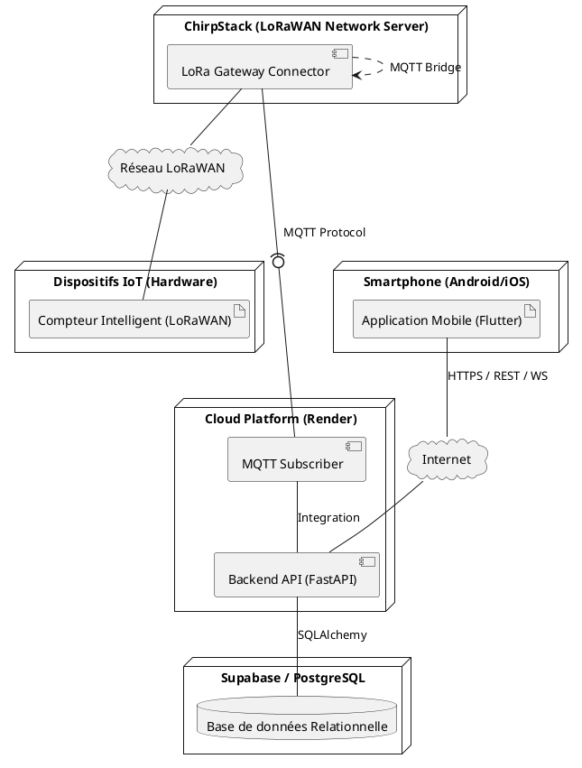

---

## 12. Diagramme de Composants

Cette vue modulaire décompose l'application en briques logiques : le client mobile (gestion d'état Riverpod, Dio), l'API FastAPI (Routers, Services) et les interfaces de persistance. Elle permet de visualiser les dépendances logicielles et les flux d'information entre les modules.

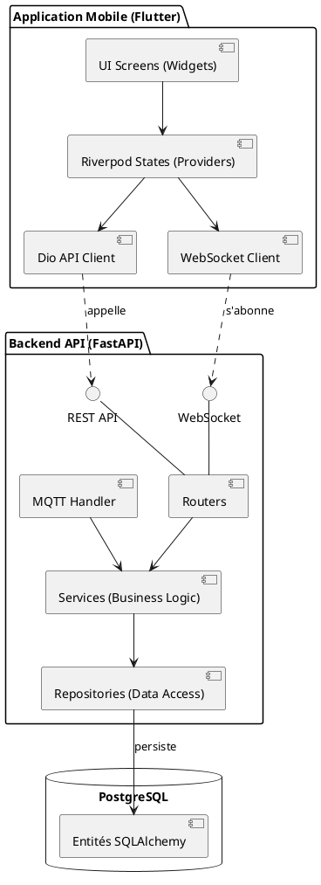

---

## 13. Diagramme d'Objets (Instance système)

Le diagramme d'objets permet de visualiser un instantané du système avec des données concrètes. Il illustre comment les entités définies dans le diagramme de classes s'instancient réellement : un utilisateur "John Doe" possédant un compteur spécifique, lié à un matériel IoT identifié, et ayant effectué une transaction de recharge réussie.

Exemple d'une instance du système à un instant T (Un utilisateur avec un compteur et une recharge).

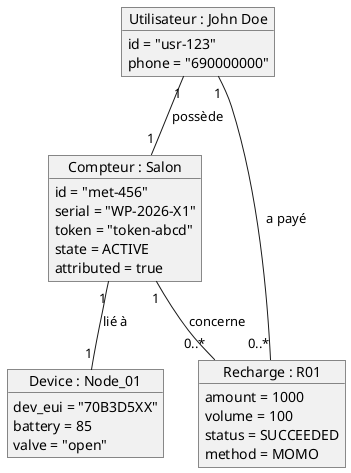

---

## 14. Diagramme de Classes — Niveau Conception (Détaillé)

Ce dernier diagramme est la vue la plus proche de l'implémentation finale. Il détaille la structure interne du code source FastAPI, mettant en lumière le "Service Pattern" et le "Repository Pattern". On y voit précisément comment les Routers délèguent la logique aux Services, qui eux-mêmes utilisent les Repositories pour manipuler les modèles persistants. C'est le guide technique de référence pour tout développeur rejoignant le projet.

Ce diagramme présente l'architecture logicielle complète du backend, montrant la séparation entre les contrôleurs (Routers), la logique métier (Services), l'accès aux données (Repositories) et les modèles persistants.

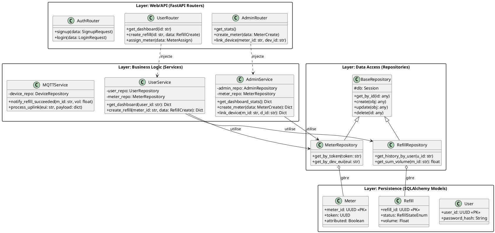
